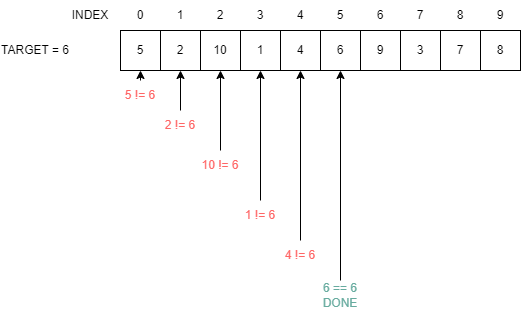

# Algorithm Description Document

Author: Chad Macbeth

Date: 06/13/2023

## 1. Name
Better Linear Search

## 2. Abstract
The Better Linear Search will search an unsorted list of numbers until either the target is found or until all items in the list have been checked.

## 3. Methodology

The Better Linear Search is a basic search of unsorted data $\lang c_1, c_2, c_3, ... c_n \rang$ for a target $t$.  Since the data is unsorted, we need to start our search with $c_1$ and compare all values until a matching value is found.  When a matching value is found, the algorithm will immediately return the index of the matching value.  If the value is not found, then -1 will be returned.



## 4. Pseudocode

```
BETTER-LINEAR-SEARCH(data, target)
    for index in [0,size of data - 1]
        if data[index] == target
            return index
    return -1
```

## 5. Inputs & Outputs

Inputs:
* data - list of values that are comparable with each other
* target - item to search for that is the same type as items in data

Outputs:
* index of data that contains the target.  If not found, then -1 is returned.

## 6. Analysis Results

* Worst Case: $O(n)$

* Best Case: $\Omega(1)$
